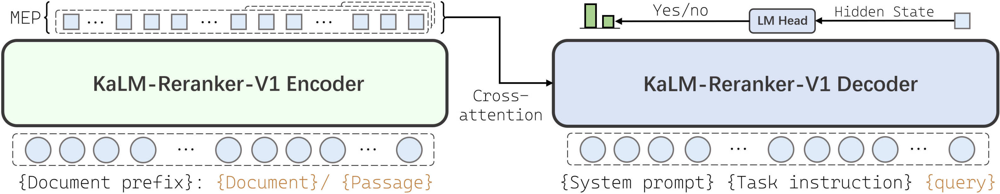
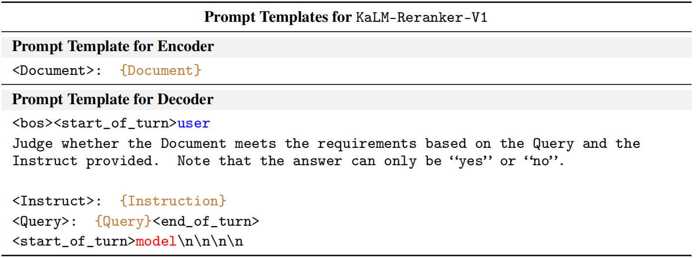
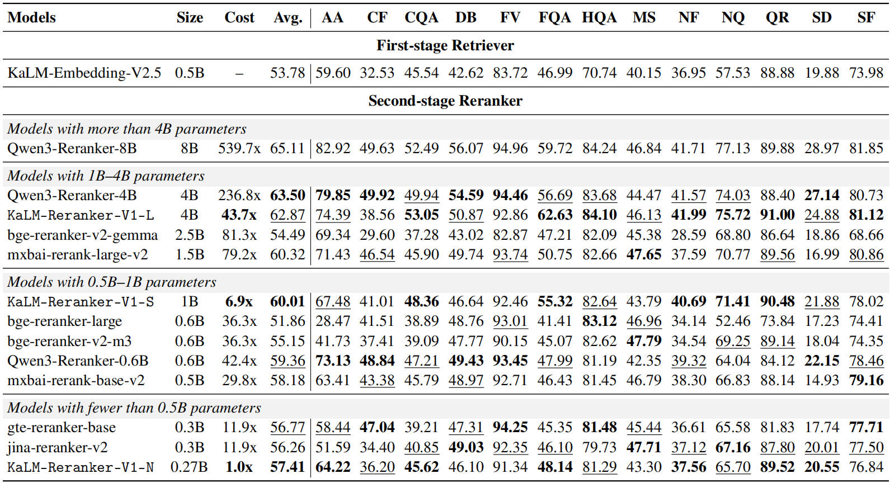
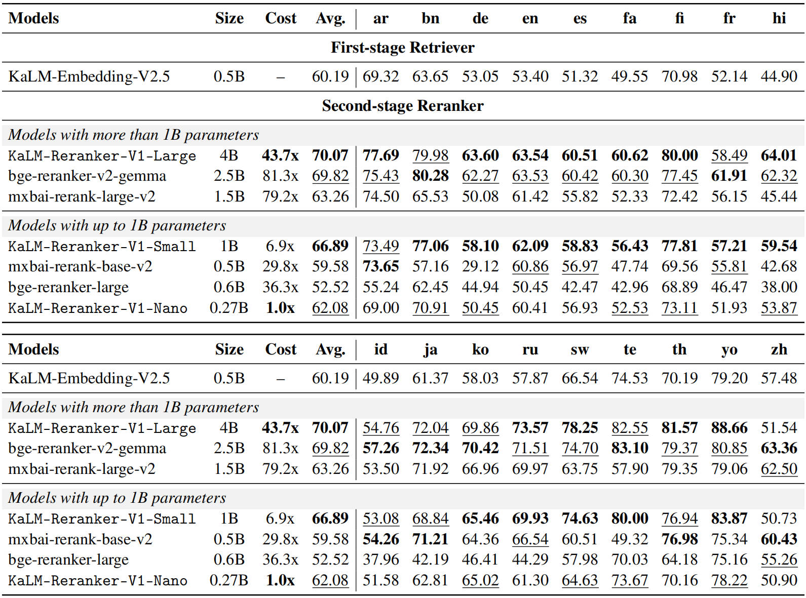
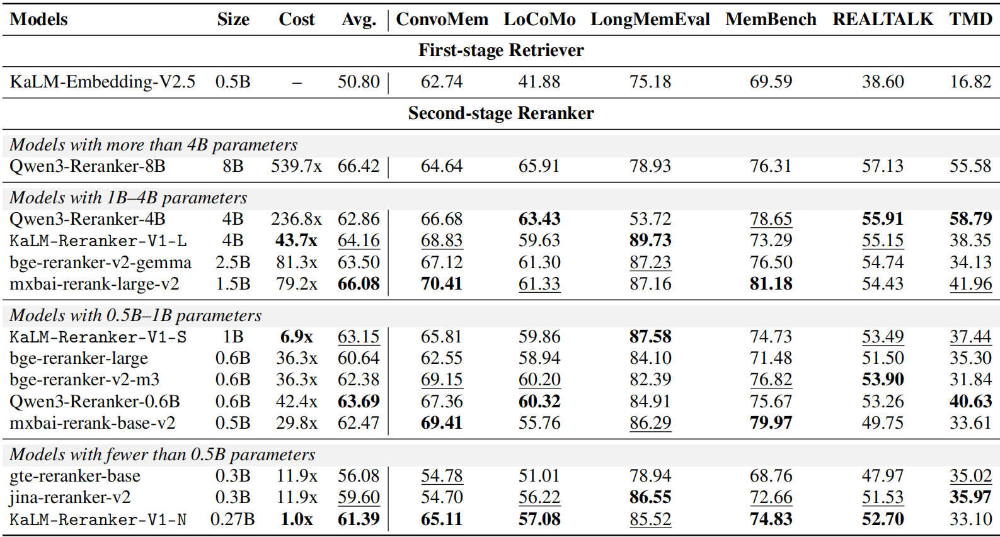
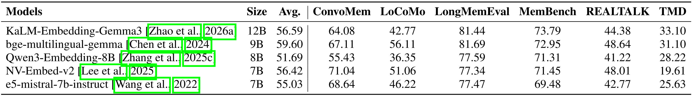

---
language:
- multilingual
base_model:
- google/t5gemma-2-4b-4b
pipeline_tag: text-ranking
datasets:
- KaLM-Embedding/KaLM-reranker-training-data
- KaLM-Embedding/KaLM-embedding-finetuning-data
- Shitao/bge-m3-data
tags:
- sentence-transformers
- transformers
- reranker
- encoder-decoder
- FBNL
- Retrieval
- RAG
license: apache-2.0
library_name: sentence-transformers
---


<h1 align="center">KaLM-Reranker-V1: Fast but Not Late Interaction for Compressed Document Reranking</h1>


<p align="center">
  <a href="https://huggingface.co/collections/KaLM-Embedding/lychee-kalm-reranker">
    
  </a>
  <a href="https://arxiv.org/abs/2606.22807">
    
  </a>
  <a href="https://arxiv.org/abs/2506.20923">
    
  </a>
  <a href="https://github.com/KaLM-Embedding">
    
  </a>
</p>


We present `KaLM-Reranker-V1`, a fast but not late-interaction (FBNL) reranker that decouples query and passage computation while retaining expressive relevance modeling. 

Built on an encoder-decoder architecture, KaLM-Reranker-V1 uses the encoder to pre-encode passages with Matryoshka embedding pooling, while the decoder models the system instruction, user instruction, and query intent; cross-attention then captures relevance between the query context and passage representations. 
This design makes KaLM-Reranker-V1 efficient through decoupled passage encoding, yet not late interaction, by preserving rich relevance modeling through cross-attention. 

We instantiate KaLM-Reranker-V1 in three sizes, `Nano`, `Small`, and `Large`, with `0.27B`, `1B`, and `4B` activated parameters, respectively.





Extensive experiments on BEIR, MIRACL, and LMEB show that the KaLM-Reranker-V1 series achieves competitive reranking performance compared with strong industrial rerankers while significantly reducing online overhead.

# Model Details
| Models | Activated Params. | Non-Embedding Params. | Embedding Params. | #Layers | Sequence Length | Document Token Dim. | MEP Support | Instruction Aware |
| ---- | ---- | ---- | ---- | ---- | ---- | ---- | ---- | ---- |
| [KaLM-Reranker-V1-Nano](https://huggingface.co/KaLM-Embedding/KaLM-Reranker-V1-Nano) | 0.27B | 100M | 168M | 18 | 128K | 640 | 1x-32x | Yes |
| [KaLM-Reranker-V1-Small](https://huggingface.co/KaLM-Embedding/KaLM-Reranker-V1-Small) | 1B | 698M | 302M | 26 | 128K | 1152 | 1x-32x | Yes |
| [KaLM-Reranker-V1-Large](https://huggingface.co/KaLM-Embedding/KaLM-Reranker-V1-Large) | 4B | 3209M | 675M | 34 | 128K | 2560 | 1x-32x | Yes |


# Prompt Template
```python
 f"<Document>: {document}"

```
```python
(
    f"<bos><start_of_turn>user\n"
    f"Judge whether the Document meets the requirements based on the Query and the Instruct provided. Note that the answer can only be \"yes\" or \"no\".\n\n"
    f"<Instruct>: {task_instruction}\n"
    f"<Query>: {query}<end_of_turn>\n"
    f"<start_of_turn>model\n\n\n\n"
)

```




# Evaluation
## BEIR
On BEIR, KaLM-Reranker-V1 achieves state-of-the-art performance, on par with strong industrial models such as the Qwen3-Reranker series.

## MIRACL
On MIRACL, despite not being extensively trained on multilingual data, KaLM-Reranker-V1 still shows excellent reranking performance.

## LMEB
On LMEB, reranking models demonstrate a clear advantage, with even the 0.27B Nano model remaining competitive with 7–12B embedding models.



# Usage
## Using Sentence Transformers

KaLM-Reranker-V1-Nano can be loaded as a modular Sentence Transformers
`CrossEncoder`. This integration requires `sentence-transformers>=5.6,<6`,
`transformers>=5.3,<6`, and the PyTorch backend. The repository contains custom
modeling code, so load only trusted revisions and pass `trust_remote_code=True`.

```bash
pip install "sentence-transformers>=5.6,<6" "transformers>=5.3,<6"
```

```python
import torch
from sentence_transformers import CrossEncoder

model = CrossEncoder(
    "KaLM-Embedding/KaLM-Reranker-V1-Nano",
    trust_remote_code=True,
    device="cuda",
    model_kwargs={"dtype": torch.bfloat16, "chunk_size": 4},
)

query = "What is the capital of China?"
documents = [
    "The capital of China is Beijing.",
    "Gravity attracts bodies toward one another.",
]
pairs = [(query, document) for document in documents]

# The default output is P(yes).
scores = model.predict(pairs)
rankings = model.rank(query, documents, return_documents=True)

# CrossEncoder prompts are interpreted as KaLM task instructions.
instruction = "Given a web search query, retrieve passages that answer the query."
custom_scores = model.predict(pairs, prompt=instruction)
custom_rankings = model.rank(query, documents, prompt=instruction)

# Use Identity to return yes_logit - no_logit instead of P(yes).
margins = model.predict(pairs, activation_fn=torch.nn.Identity())

print(f"scores: {scores}")
print(f"rankings: {rankings}")
print(f"custom_scores: {custom_scores}")
print(f"custom_rankings: {custom_rankings}")
print(f"margins: {margins}")

'''
scores: [9.9984646e-01 6.8936106e-07]
rankings: [{'corpus_id': 0, 'score': 0.99984646, 'text': 'The capital of China is Beijing.'}, {'corpus_id': 1, 'score': 6.8936106e-07, 'text': 'Gravity attracts bodies toward one another.'}]
custom_scores: [9.972850e-01 5.896418e-07]
custom_rankings: [{'corpus_id': 0, 'score': 0.997285}, {'corpus_id': 1, 'score': 5.896418e-07}]
margins: [  8.78125 -14.1875 ]
'''

```

Inputs must be ordered as `(query, document)`. By default, queries are
truncated to 512 tokens and documents to 1024 tokens. `chunk_size=4` performs a
mask-aware mean over each consecutive group of four encoder token states before
passing the compressed encoder output to the decoder. Set `chunk_size=None` to
disable compression, or change `model[0].chunk_size` after loading.

For CPU inference, use `device="cpu"` and
`model_kwargs={"dtype": torch.float32, "chunk_size": 4}`. Only the PyTorch
inference backend is currently supported; training, ONNX, and OpenVINO are not
included in this release.

## Using transformers
```python
import argparse
from typing import Optional


def optional_positive_int(value: str) -> Optional[int]:
    if value.lower() == "none":
        return None
    try:
        parsed = int(value)
    except ValueError as error:
        raise argparse.ArgumentTypeError(
            "must be a positive integer or 'none'"
        ) from error
    if parsed <= 0:
        raise argparse.ArgumentTypeError("must be a positive integer or 'none'")
    return parsed


def build_parser() -> argparse.ArgumentParser:
    parser = argparse.ArgumentParser(
        formatter_class=argparse.ArgumentDefaultsHelpFormatter,
    )
    parser.add_argument(
        "--model",
        default="KaLM-Embedding/KaLM-Reranker-V1-Large",
        help="Hugging Face model ID or local checkpoint path.",
    )
    parser.add_argument(
        "--device",
        default=None,
        help="Inference device, such as 'cuda', 'cuda:0', or 'cpu'.",
    )
    parser.add_argument(
        "--dtype",
        default=None,
        choices=("bfloat16", "bf16", "float16", "fp16", "float32", "fp32"),
        help="Model parameter dtype. By default, use BF16 on CUDA and FP32 on CPU.",
    )
    parser.add_argument(
        "--batch-size",
        type=int,
        default=32,
        help="Number of query-document pairs scored per inference batch.",
    )
    parser.add_argument(
        "--query-max-length",
        type=int,
        default=512,
        help=(
            "Maximum tokens in the raw query before it is inserted into the "
            "decoder prompt; prompt tokens are not included in this limit."
        ),
    )
    parser.add_argument(
        "--reranker-max-length",
        type=int,
        default=1024,
        help=(
            "Maximum encoder tokens for '<Document>: {passage}'. This is not a "
            "combined query-document context limit."
        ),
    )
    parser.add_argument(
        "--chunk-size",
        type=optional_positive_int,
        default=4,
        metavar="N|none",
        help=(
            "Number of encoder token hidden states per mean-pooled chunk; use "
            "'none' to disable encoder chunk pooling."
        ),
    )
    return parser


def main() -> None:
    args = build_parser().parse_args()

    from kalm_reranker import KaLMReranker

    reranker = KaLMReranker(
        args.model,
        device=args.device,
        dtype=args.dtype,
        batch_size=args.batch_size,
        query_max_length=args.query_max_length,
        max_length=args.reranker_max_length,
        chunk_size=args.chunk_size,
    )
    query = "What is the capital of China?"
    documents = [
        "The capital of China is Beijing.",
        "Gravity attracts bodies toward one another.",
    ]
    instruction = "Given a query, retrieve documents that answer the query."

    pairs = [(query, document) for document in documents]
    print("scores:", reranker.predict(pairs, instruction=instruction))
    print("rankings:", reranker.rank(query, documents, instruction=instruction))
    

if __name__ == "__main__":
    main()

'''
scores: [0.9998464584350586, 6.893610020597407e-07]
rankings: [{'corpus_id': 0, 'score': 0.9998464584350586}, {'corpus_id': 1, 'score': 6.893610020597407e-07}]
'''

```

## Using vLLM
An experimental single-GPU adapter is available for offline
`LLM.classify()` reranking and optional FastAPI serving. It reuses the original
checkpoint without adding or modifying model weights.

The adapter has been validated with Python 3.12, vLLM 0.19.1, Transformers
5.6.2 and CUDA BF16:

```bash
conda create -n kalm-vllm python=3.12 -y
conda activate kalm-vllm
pip install "vllm==0.19.1" "transformers==5.6.2"

hf download KaLM-Embedding/KaLM-Reranker-V1-Large \
  --local-dir ./KaLM-Reranker-V1-Large
pip install ./KaLM-Reranker-V1-Large/vllm_support --no-deps
export VLLM_PLUGINS=kalm_t5gemma2
```

If you modify the `vllm_support` source code for some reason 
(e.g. changing the model path in `vllm_support/src/kalm_t5gemma2_vllm_plugin/constants.py`), 
please run `pip install ./KaLM-Reranker-V1-Large/vllm_support --no-deps --force-reinstall` to refresh the patch.

Offline Python:

```python
from kalm_t5gemma2_vllm_plugin import KaLMVLLMReranker

query = "What is the capital of China?"
documents = [
    "The capital of China is Beijing.",
    "Gravity attracts bodies toward one another.",
]

with KaLMVLLMReranker(
    "KaLM-Embedding/KaLM-Reranker-V1-Large",
    query_max_length=512,
    document_max_length=1024,
    encoder_chunk_size=4,
) as reranker:
    print(reranker.rank(query, documents))
```

Offline CLI:

```bash
kalm-vllm-rerank --return-margin
```

To deploy the online service, install the HTTP dependencies and keep the
server running in the first terminal:

```bash
pip install "fastapi>=0.136,<0.137" "uvicorn>=0.46,<0.47"
export CUDA_VISIBLE_DEVICES=0
export VLLM_PLUGINS=kalm_t5gemma2

kalm-vllm-serve \
  --host 0.0.0.0 \
  --port 8000 \
  --model KaLM-Embedding/KaLM-Reranker-V1-Large \
  --query-max-length 512 \
  --document-max-length 1024 \
  --encoder-chunk-size 4 \
  --max-model-len 2048
```

In a second terminal, check the server:

```bash
conda activate kalm-vllm
kalm-vllm-client --base-url http://127.0.0.1:8000 --health
```

Use `/rerank` for one query and a list of documents. Results are sorted by
score:

```bash
kalm-vllm-client \
  --base-url http://127.0.0.1:8000 \
  --endpoint rerank \
  --json-file ./KaLM-Reranker-V1-Large/vllm_support/examples/rerank_request.json \
  --return-margin \
  --top-k 10
```

Use `/score` to score a batch of independent query-document pairs. Results
preserve the input order and optional IDs:

```bash
kalm-vllm-client \
  --base-url http://127.0.0.1:8000 \
  --endpoint score \
  --json-file ./KaLM-Reranker-V1-Large/vllm_support/examples/score_request.json \
  --return-margin
```

The default output is `P(yes)`. Set `return_margin=true` to also receive
`yes_logit - no_logit`; the client flag `--return-margin` applies the same
setting to a JSON file request. The supported encoder chunk sizes are
`1, 2, 4, 8, 16, 32`, with `4` as the default.

This adapter uses vLLM's plugin, scheduling and pooling interfaces while the
T5Gemma2 semantic forward still runs through Transformers. It is not vLLM's
native HTTP `/score` implementation or a complete vLLM-native kernel port.
See [the complete installation, API and troubleshooting guide](./vllm_support/README.md).

# Acknowledgements
We sincerely thank `jina-reranker-v3` and `Qwen3-Reranker` for their valuable inspiration and contributions to the reranking community, from which we have learned a lot.

# Citation
If you find this model useful, please consider citing our papers.
```
@misc{zhao2026kalmrerankerv1,
      title={KaLM-Reranker-V1: Fast but Not Late Interaction for Compressed Document Reranking}, 
      author={Xinping Zhao and Jiaxin Xu and Ziqi Dai and Xin Zhang and Shouzheng Huang and Danyu Tang and Xinshuo Hu and Meishan Zhang and Baotian Hu and Min Zhang},
      year={2026},
      eprint={2606.22807},
      archivePrefix={arXiv},
      primaryClass={cs.CL},
      url={https://arxiv.org/abs/2606.22807}, 
}

@inproceedings{zhao2026kalmembeddingv2,
      title={KaLM-Embedding-V2: Superior Training Techniques and Data Inspire A Versatile Embedding Model},
      author={Xinping Zhao and Xinshuo Hu and Zifei Shan and Shouzheng Huang and Yao Zhou and Xin Zhang and Zetian Sun and Zhenyu Liu and Dongfang Li and Xinyuan Wei and Youcheng Pan and Yang Xiang and Meishan Zhang and Haofen Wang and Jun Yu and Baotian Hu and Min Zhang},
      booktitle={The Fourteenth International Conference on Learning Representations},
      year={2026},
      url={https://openreview.net/forum?id=Y7qzhvWhcz}
}

@misc{hu2025kalmembedding,
      title={KaLM-Embedding: Superior Training Data Brings A Stronger Embedding Model}, 
      author={Xinshuo Hu and Zifei Shan and Xinping Zhao and Zetian Sun and Zhenyu Liu and Dongfang Li and Shaolin Ye and Xinyuan Wei and Qian Chen and Baotian Hu and Haofen Wang and Jun Yu and Min Zhang},
      year={2025},
      eprint={2501.01028},
      archivePrefix={arXiv},
      primaryClass={cs.CL},
      url={https://arxiv.org/abs/2501.01028}, 
}
```

## Contact
If you encounter any issues, feel free to contact us via the email: <zhaoxinping@stu.hit.edu.cn>