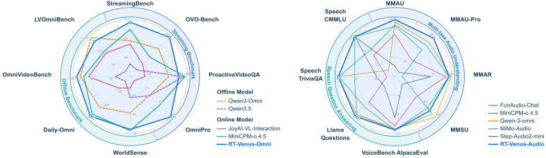
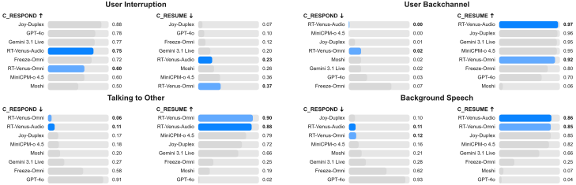

<p align="center" style="text-align: center;">
  
</p>

<h1 align="center" style="text-align: center;">Realtime-Venus</h1>

<p align="center" style="text-align: center;"><strong>支持异步任务委派的全双工交互系统</strong></p>

<p align="center" style="text-align: center;"><a href="https://huggingface.co/inclusionAI/Realtime-Venus">English</a> | <strong>简体中文</strong></p>

<p align="center" style="text-align: center;">
<a href="https://realtime-venus.github.io/"></a>
<a href="https://huggingface.co/inclusionAI/Realtime-Venus"></a>
<a href="https://www.modelscope.cn/models/inclusionAI/Realtime-Venus"></a>
<a href="https://arxiv.org/abs/2609.13814"></a>
<a href="https://github.com/inclusionAI/Realtime-Venus"></a>
<a href="https://huggingface.co/inclusionAI/Realtime-Venus/blob/main/LICENSE"></a>
</p>

<p align="center">
  <a href="https://arxiv.org/abs/2609.13814">
    
  </a>
</p>
<p align="center"><em>Realtime-Venus 支持主动音视频交互、异步任务委派，以及能够感知打断的全双工对话。</em></p>

## 1. 🧭 概览

本仓库提供 [Realtime-Venus](https://realtime-venus.github.io/) 系统的两款模型：

- **Realtime-Venus-Omni**（`Realtime-Venus-Omni/`）：9B 音视频交互模型，能够持续理解画面与声音，自主判断是否需要回应、何时回应，并在统一的因果时间线上生成文本和语音。模型基于 MiniCPM-o 4.5 构建，支持主动交互、语义级打断处理，以及无需额外训练的长视频记忆（Memory）。
- **Realtime-Venus-Audio**（`Realtime-Venus-Audio/`）：专注于音频理解和语音对话，采用与 Omni 相同的流式主干网络，可输出文本或语音。

两个模型目录均包含权重和自定义的 Hugging Face Transformers 代码。负责异步任务执行的 Realtime-Venus-Harness 及其外部工具集成见 [GitHub 仓库](https://github.com/inclusionAI/Realtime-Venus)。

## 2. ✨ 核心亮点

- **原生全双工对话：** 模型在说话时仍持续感知输入，能够区分用户的简短附和、打断、纠正和话题切换。
- **Omni-Proactive 主动交互：** 持续理解时间对齐的音视频内容，在需要回应的事件发生时主动发言，无需等待用户提示。
- **异步任务委派：** 通过流内 `<delegate>` 请求发起任务，并在同一条因果时间线上接收后端异步返回的结果。外部任务与对话并行运行，不会阻塞当前交流。执行这些请求需要 Realtime-Venus-Harness 运行时，详见 [GitHub 仓库](https://github.com/inclusionAI/Realtime-Venus)。
- **无需额外训练的长视频记忆：** 记录视觉信息丰富的时刻，根据问题检索相关且不重复的证据，再重组对应的音视频上下文。
- **文本与语音输出：** 使用仓库提供的 Token2wav 资源和参考音色，在生成回复文本的同时输出原生语音。

## 3. 📋 模型信息

| 项目 | Realtime-Venus-Omni | Realtime-Venus-Audio |
| --- | --- | --- |
| 参数量 | 9B | 9B |
| 基础架构 | MiniCPM-o 4.5 / Omni-Flow | MiniCPM-o 4.5 / Omni-Flow |
| 视觉编码器 | SigLIP2 | 推理时不使用 |
| 音频编码器 | Whisper-Medium | Whisper-Medium |
| 语言模型主干 | Qwen3-8B | Qwen3-8B |
| 语音生成 | 离散 S3 语音 token，配合流式流匹配解码器 | 使用相同解码器，在全双工模式下启用 |
| 输入 | 视频/图像、音频和文本 | 音频和文本 |
| 输出 | 文本，以及可选的语音波形 | 文本和语音波形 |
| 上下文长度 | 40,960 tokens | 40,960 tokens |
| 权重精度 | BF16 | BF16 |

## 4. 📊 评测

以下结果均引自 [Realtime-Venus 技术报告](https://arxiv.org/abs/2609.13814)。

<p align="center"><br /><sub>图 1. <a href="https://arxiv.org/html/2609.13814v1#S0.F1">论文</a>中的视频和音频理解评测结果。</sub></p>

<p align="center"><br /><sub>图 2. <a href="https://arxiv.org/html/2609.13814v1#S0.F2">论文</a>中的全双工交互评测结果。</sub></p>

## 5. 🗂️ 仓库结构

```text
.
├── Realtime-Venus-Omni/          # 音视频全双工模型
│   ├── model-*.safetensors       # 分片模型权重
│   ├── config.json, *.py         # 模型配置与自定义 Transformers 代码
│   ├── realtime_venus_omni_memory.py  # 记忆功能的公开入口
│   ├── memory_adapter/           # 对话与全双工模式的记忆运行时
│   ├── assets/                   # 参考音色、Token2wav、演示视频
│   └── requirements.txt
├── Realtime-Venus-Audio/         # 专注于音频的模型
│   ├── model-*.safetensors       # 分片模型权重
│   ├── config.json, *.py         # 模型配置与自定义 Transformers 代码
│   └── assets/                   # 参考音色、Token2wav、演示音频
├── assets/                      # 品牌资源（标志）
├── config.yaml                  # 模型名称与下载目录映射
├── download_models.py           # Omni / Audio / all 统一下载入口
├── README.md
├── README_zh.md
└── LICENSE
```

下文示例将生成的媒体文件写入 `output/`。重复运行实验时，请使用新的文件名或输出目录。

## 6. 🛠️ 安装

运行推理示例需要 Python 3.10、CUDA 和 FFmpeg。首先安装下载依赖，并从本 Hugging Face 仓库获取统一下载脚本：

```bash
python -m pip install 'huggingface_hub>=0.34' 'PyYAML>=6.0'
hf download inclusionAI/Realtime-Venus download_models.py --local-dir .
```

然后选择需要下载的模型：

| `--model` | 下载内容 |
| --- | --- |
| `omni` | 用于音视频交互的 Realtime-Venus-Omni |
| `audio` | 用于音频理解与语音对话的 Realtime-Venus-Audio |
| `all` | 两款模型 |

例如，将两款模型下载到当前目录：

```bash
python download_models.py --model all --local-dir .
```

如只需一款模型，将参数改为 `--model omni` 或 `--model audio`。下载器读取本仓库根目录的 `config.yaml`，下载所选模型的完整子目录，包括权重、自定义代码和资源文件；同时保存下载清单，并使用 Hugging Face Hub 的标准进度显示与缓存。单次下载中的所有文件均来自同一个仓库版本。

下载后安装推理依赖。选择 Omni 或 `all` 时运行：

```bash
python -m pip install -r Realtime-Venus-Omni/requirements.txt
```

Audio 使用相同的已发布依赖清单，没有独立的 `requirements.txt`。如果只下载了 Audio，先单独获取这份小文件，无需下载 Omni 权重：

```bash
hf download inclusionAI/Realtime-Venus Realtime-Venus-Omni/requirements.txt --local-dir .
python -m pip install -r Realtime-Venus-Omni/requirements.txt
```

也可以在包含 `download_models.py` 的目录中，通过 Python 完成一次下载准备。它与上述命令使用同一个下载入口：

```python
from download_models import download_models

paths = download_models(model="omni", local_dir=".")  # 可选 "omni"、"audio" 或 "all"
model_dir = paths["omni"]  # pathlib.Path；Audio 使用 paths["audio"]
```

下文推理示例直接加载下载后的本地模型目录。请在同一目录中运行，资源文件和输出路径均相对于当前目录。

也可以独立使用 ModelScope CLI（需另行安装）下载整个镜像仓库：

```bash
modelscope download --model inclusionAI/Realtime-Venus --local_dir .
```

该镜像命令与上述 Hugging Face 下载器相互独立。

## 7. 🎙️ Realtime-Venus-Omni 使用方法

这些示例的独立可运行脚本位于 GitHub 上的 [Omni cookbook](https://github.com/inclusionAI/Realtime-Venus/tree/main/frontend/Realtime-Venus-Omni)。

### 7.1 🧱 模型初始化

下文示例共用以下模型初始化代码；请在新的 Python 进程中分别运行每个示例。普通对话和全双工对话均会自动加载默认参考音色。

<details>
<summary>点击展开 Omni 模型加载代码。</summary>

```python
from pathlib import Path

import torch
from transformers import AutoModel, set_seed

Path("output").mkdir(exist_ok=True)
set_seed(42)
print("Loading model ...")
model = AutoModel.from_pretrained(
    "./Realtime-Venus-Omni",  # or an absolute path to the sub-directory
    trust_remote_code=True,
    local_files_only=True,
    attn_implementation="sdpa",
    torch_dtype=torch.bfloat16,
)
model.eval().cuda()
print("Model loaded.")
```

</details>

### 7.2 🔊 全双工 Omni 模式

调用 `model = model.as_duplex()` 可切换为全双工流式模式：`prepare()` 初始化会话，随后每秒输入由一对 `streaming_prefill()` 和 `streaming_generate()` 调用处理；`as_simplex()` 则切换回离线模式。请在导入 `minicpmo.utils` 之前设置 `MAX_NUM_FRAMES`，否则超过 64 秒的视频会受到默认帧数上限的截断。

字幕字体说明：全双工示例通过 FFmpeg/libass 将回复文本烧录到输出视频中，字体由 fontconfig 查找。渲染中文等非拉丁文字需要系统安装支持中日韩字符的字体，否则相应字符会显示为空白方框。在 Linux 发行版中，可以无需 root 权限安装字体并刷新字体缓存：

```bash
mkdir -p ~/.local/share/fonts
curl --fail --location --retry 3 \
  --output ~/.local/share/fonts/NotoSansCJKsc-Regular.otf \
  https://raw.githubusercontent.com/notofonts/noto-cjk/main/Sans/OTF/SimplifiedChinese/NotoSansCJKsc-Regular.otf
fc-cache -f
```

也可以通过包管理器安装：Debian/Ubuntu 使用 `apt install -y fonts-noto-cjk`；RHEL/Alibaba Cloud Linux 使用 `yum install -y cjkuni-ukai-fonts cjkuni-uming-fonts`。无需修改代码。

#### 7.2.1 全双工对话

逐秒流式输入演示视频，并在 `question_times` 指定的时间注入与 `questions` 一一对应的文本问题。模型持续聆听，并在回答时生成语音。

<details>
<summary>点击展开全双工对话代码。</summary>

```python
import os

os.environ["MAX_NUM_FRAMES"] = "100000"

from minicpmo.utils import get_video_frame_audio_segments, generate_duplex_video

model = model.as_duplex()  # switch to full-duplex streaming
model.prepare()

video_path = "Realtime-Venus-Omni/assets/sample_1_real.mp4"
# each question is injected at the corresponding second
question_times = [60, 128]
questions = [
    "What do you see in the video so far?",
    "What is the color of the cooler labeled PRIME near the team bench?",
]
question_plan = dict(zip(question_times, questions))
print(f"Extracting per-second audio and frames from {video_path} ...")
frames, audios, _ = get_video_frame_audio_segments(
    video_path, stack_frames=1, use_ffmpeg=True, adjust_audio_length=True
)
print(f"Streaming {len(audios)} seconds; questions are injected at {question_times}.")
results, output_audio = [], []
for second, (frame, audio) in enumerate(zip(frames, audios), start=1):
    model.streaming_prefill(
        audio_waveform=audio,
        frame_list=[frame] if frame is not None else None,
        text_list=[question_plan[second]] if second in question_plan else None,
    )
    result = model.streaming_generate()
    print(
        f"[{second}/{len(audios)}]",
        "listen..." if result["is_listen"] else f"speak> {result['text']}",
        flush=True,
    )
    results.append({"chunk_idx": second - 1, **result})
    if result["audio_waveform"] is not None:
        output_audio.append((second - 1, result["audio_waveform"]))

model = model.as_simplex()
print("Muxing the spoken responses into the output video ...")
generate_duplex_video(
    video_path=video_path,
    output_video_path="output/duplex_chat.mp4",
    results_log=results,
    timed_output_audio=output_audio,
)
```

</details>

#### 7.2.2 语音输入的全双工对话

流程与上例相同，但问题以语音形式预先混入视频音轨（约第 3 秒，请求在水烧开时发出提醒）。因此，示例不注入文本问题，模型必须从音频中听取问题。

<details>
<summary>点击展开语音输入的全双工对话代码。</summary>

```python
import os

os.environ["MAX_NUM_FRAMES"] = "100000"

from minicpmo.utils import get_video_frame_audio_segments, generate_duplex_video

model = model.as_duplex()  # switch to full-duplex streaming
model.prepare()

video_path = "Realtime-Venus-Omni/assets/speech_in.mp4"
print(f"Extracting per-second audio and frames from {video_path} ...")
frames, audios, _ = get_video_frame_audio_segments(
    video_path, stack_frames=1, use_ffmpeg=True, adjust_audio_length=True
)
print(f"Streaming {len(audios)} seconds; the spoken question is already in the audio track.")
results, output_audio = [], []
for second, (frame, audio) in enumerate(zip(frames, audios), start=1):
    model.streaming_prefill(
        audio_waveform=audio,
        frame_list=[frame] if frame is not None else None,
    )
    result = model.streaming_generate()
    print(
        f"[{second}/{len(audios)}]",
        "listen..." if result["is_listen"] else result["text"],
        flush=True,
    )
    results.append({"chunk_idx": second - 1, **result})
    if result["audio_waveform"] is not None:
        output_audio.append((second - 1, result["audio_waveform"]))

model = model.as_simplex()
print("Muxing the spoken responses into the output video ...")
generate_duplex_video(
    video_path=video_path,
    output_video_path="output/duplex_speech_in_chat.mp4",
    results_log=results,
    timed_output_audio=output_audio,
)
```

</details>

#### 7.2.3 带记忆的全双工对话

在进入全双工模式前调用 `model.use_memory(memory_minutes=40)`，即可启用长视频记忆。

<details>
<summary>点击展开带记忆的全双工对话代码。</summary>

```python
import os

os.environ["MAX_NUM_FRAMES"] = "100000"

from minicpmo.utils import get_video_frame_audio_segments, generate_duplex_video

model.use_memory(memory_minutes=40)  # enable long-video memory
model = model.as_duplex()  # switch to full-duplex streaming
model.prepare()

video_path = "Realtime-Venus-Omni/assets/sample_1_real.mp4"
question = "What is the color of the cooler labeled PRIME near the team bench?"
print(f"Extracting per-second audio and frames from {video_path} ...")
frames, audios, _ = get_video_frame_audio_segments(
    video_path, stack_frames=1, use_ffmpeg=True, adjust_audio_length=True
)
print(f"Streaming {len(audios)} seconds; the text question is injected at second 128.")
results, output_audio = [], []
for second, (frame, audio) in enumerate(zip(frames, audios), start=1):
    model.streaming_prefill(
        audio_waveform=audio,
        frame_list=[frame] if frame is not None else None,
        text_list=[question] if second == 128 else None,
    )
    result = model.streaming_generate()
    print(
        f"[{second}/{len(audios)}]",
        "listen..." if result["is_listen"] else f"speak> {result['text']}",
        flush=True,
    )
    results.append({"chunk_idx": second - 1, **result})
    if result["audio_waveform"] is not None:
        output_audio.append((second - 1, result["audio_waveform"]))

model = model.as_simplex()
print("Muxing the spoken responses into the output video ...")
generate_duplex_video(
    video_path=video_path,
    output_video_path="output/duplex_memory_chat.mp4",
    results_log=results,
    timed_output_audio=output_audio,
)
```

</details>

### 7.3 💬 半双工 Omni 模式

`model.chat(...)` 以完整视频为输入，每次回答一轮问题。`model.init_tts()` 用于启用语音输出。

#### 7.3.1 离线对话

将采样后的视频帧、逐秒音频和问题一起传入一次 `chat()` 调用。128 帧上限（`MAX_NUM_FRAMES`）用于控制视觉输入规模，`max_inp_length=32768` 用于设置输入 token 预算。完整音频仍会保留，因此即使对视频帧进行了采样，超长视频也可能超过该预算。

<details>
<summary>点击展开离线对话代码。</summary>

```python
import os

os.environ.setdefault("MAX_NUM_FRAMES", "128")

from minicpmo.utils import get_video_frame_audio_segments

model.init_tts()  # enable speech output

video_path = "Realtime-Venus-Omni/assets/sample_1_real.mp4"
question = "What is the color of the cooler labeled PRIME near the team bench?"
print(f"Extracting audio and frames from {video_path} ...")
frames, audios, _ = get_video_frame_audio_segments(
    video_path, stack_frames=1
)
content = []
for frame, audio in zip(frames, audios):
    if frame is not None:
        content.append(frame)
    content.append(audio)
content.append(question)

print("Running chat inference ...")
response = model.chat(
    msgs=[{"role": "user", "content": content}],
    max_new_tokens=4096,
    max_inp_length=32768,
    do_sample=True,
    temperature=0.7,
    use_image_id=False,
    max_slice_nums=1,
    use_tts_template=True,
    enable_thinking=False,
    omni_mode=True,
    generate_audio=True,
    output_audio_path="output/offline_chat.wav",
)
print(response)
```

</details>

#### 7.3.2 带记忆的离线对话

在调用对话接口前，通过 `model.use_memory()` 启用记忆功能。检索最多选择 96 个历史帧和 4 个近期帧，并为每个选中帧保留前后各 1 秒的音频。

<details>
<summary>点击展开带记忆的离线对话代码。</summary>

```python
import os

os.environ["MAX_NUM_FRAMES"] = "100000"

from minicpmo.utils import get_video_frame_audio_segments

model.use_memory()  # enable long-video memory
model.init_tts()  # enable speech output

video_path = "Realtime-Venus-Omni/assets/sample_1_real.mp4"
question = "What is the color of the cooler labeled PRIME near the team bench?"
print(f"Extracting audio and frames from {video_path} ...")
frames, audios, _ = get_video_frame_audio_segments(
    video_path, stack_frames=1, use_ffmpeg=True, adjust_audio_length=True
)
content = []
for frame, audio in zip(frames, audios):
    if frame is not None:
        content.append(frame)
    content.append(audio)
content.append(question)

print("Running chat inference ...")
response = model.chat(
    msgs=[{"role": "user", "content": content}],
    max_new_tokens=4096,
    max_inp_length=32768,
    do_sample=True,
    temperature=0.7,
    use_image_id=False,
    max_slice_nums=1,
    use_tts_template=True,
    enable_thinking=False,
    omni_mode=True,
    generate_audio=True,
    output_audio_path="output/offline_memory_chat.wav",
)
print(response)
```

</details>

## 8. 🎧 Realtime-Venus-Audio 使用方法

这些示例的独立可运行脚本位于 GitHub 上的 [Audio cookbook](https://github.com/inclusionAI/Realtime-Venus/tree/main/frontend/Realtime-Venus-Audio)。

Audio 模型支持两种纯音频推理方式：逐轮调用 `model.chat` 生成文本回复，以及使用全双工流式 API 生成语音回复。输入可来自音频或视频文件，统一解码为 16 kHz 单声道音频。

### 8.1 🧱 模型初始化

下方代码通过 `init_tts=True` 启用语音输出，使同一个 `model` 可用于后文的两个示例。若只需要文本回复，可设置 `init_tts=False` 以加快加载。

<details>
<summary>点击展开 Audio 模型加载代码。</summary>

```python
from pathlib import Path

import torch
from transformers import AutoModel, AutoTokenizer, set_seed

Path("output").mkdir(exist_ok=True)
set_seed(42)
print("Loading model ...")
tokenizer = AutoTokenizer.from_pretrained(
    "./Realtime-Venus-Audio", trust_remote_code=True, local_files_only=True,
    fix_mistral_regex=True,
)
model = AutoModel.from_pretrained(
    "./Realtime-Venus-Audio",
    trust_remote_code=True,
    local_files_only=True,
    attn_implementation="sdpa",
    torch_dtype=torch.bfloat16,
    init_vision=False,  # audio-only usage
    init_audio=True,
    init_tts=True,      # speech output; set False for text-only chat
).eval().cuda()
print("Model loaded.")
```

</details>

### 8.2 💭 离线对话

对完整音频输入进行一轮确定性推理：将音频（以及可选的文本指令）传入一次 `model.chat()` 调用。

<details>
<summary>点击展开离线对话代码。</summary>

```python
import librosa

print("Loading audio ...")
audio, _ = librosa.load(
    "Realtime-Venus-Audio/assets/case_offline.wav", sr=16000, mono=True
)
msgs = [
    {"role": "system", "content": "You are a helpful assistant."},
    {"role": "user", "content": [audio, "What is the speaker asking about?"]},
]

print("Running chat inference ...")
answer = model.chat(
    msgs=msgs,
    tokenizer=tokenizer,
    do_sample=False,
    max_new_tokens=2048,
    enable_thinking=False,
    use_tts_template=True,
    generate_audio=False,
)
print(answer)
```

</details>

### 8.3 🎙️ 全双工对话

调用 `model.as_duplex(generate_audio=True)` 切换为全双工流式模式：逐秒输入音频，模型持续聆听，并在回答时生成语音。示例在输入末尾追加 10 秒静音，使模型能够在输入结束后说完回复，并将生成的语音写入 `output/audio_full_duplex.wav`。

<details>
<summary>点击展开全双工对话代码。</summary>

```python
import librosa
import numpy as np
import soundfile as sf

duplex = model.as_duplex(generate_audio=True)  # full-duplex with speech output
duplex.prepare(prompt_wav_path="Realtime-Venus-Audio/assets/HT_ref_audio.wav")

audio, _ = librosa.load(
    "Realtime-Venus-Audio/assets/case_duplex.wav", sr=16000, mono=True
)
audio = np.concatenate([audio, np.zeros(10 * 16000, dtype=np.float32)])

chunk_samples = int(duplex.CHUNK_MS * duplex.SAMPLE_RATE / 1000)
total_chunks = max(1, (len(audio) + chunk_samples - 1) // chunk_samples)
timed_audio = []
for chunk_index in range(total_chunks):
    chunk = audio[chunk_index * chunk_samples:(chunk_index + 1) * chunk_samples]
    if len(chunk) < chunk_samples:
        chunk = np.pad(chunk, (0, chunk_samples - len(chunk)))
    duplex.streaming_prefill(audio_waveform=chunk)
    result = duplex.streaming_generate(
        max_new_speak_tokens_per_chunk=20,
        decode_mode="sampling",
        temperature=0.7,
        top_k=20,
        top_p=0.8,
        listen_prob_scale=1.0,
    )
    state = "listen" if result["is_listen"] else f"speak> {result['text']}"
    print(f"[{chunk_index + 1}/{total_chunks}] {state}", flush=True)
    if result["audio_waveform"] is not None and not result["is_listen"]:
        timed_audio.append((chunk_index, result["audio_waveform"]))

# stitch the generated speech on its original timeline (24 kHz)
sample_rate = 24000
total_samples = max(
    t * sample_rate + len(np.asarray(w, dtype=np.float32).squeeze())
    for t, w in timed_audio
)
output = np.zeros(total_samples, dtype=np.float32)
for t, waveform in timed_audio:
    w = np.asarray(waveform, dtype=np.float32).squeeze()
    output[t * sample_rate: t * sample_rate + len(w)] += w
sf.write("output/audio_full_duplex.wav", np.clip(output, -1.0, 1.0), sample_rate)
print("Saved generated speech to output/audio_full_duplex.wav")
```

</details>

## 9. 📝 引用

如果 Realtime-Venus 对你的工作有帮助，请引用技术报告：

```bibtex
@article{zhao2026realtime,
  title={{Realtime-Venus}: A full-duplex interaction system with asynchronous delegation},
  author={{Venus Team(Ant Group), Tsinghua University}},
  journal={arXiv preprint arXiv:2609.13814},
  year={2026}
}
```

## 10. 📄 许可证

本仓库包含 [Apache License 2.0](./LICENSE)。另请查阅上游模型、第三方库，以及与本模型配合使用的数据各自的许可证和可接受使用条款。
