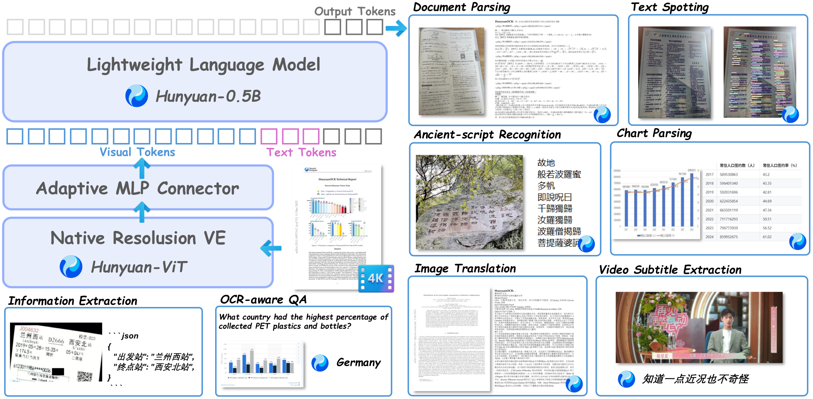

<p align="center">
  
</p>

<p align="center">
<a href="https://hunyuan.tencent.com/chat/HunyuanDefault?modelId=HY-OCR-1.0&mid=308&from=vision-zh"><b>🎯 Demo</b></a> |
<a href="https://huggingface.co/tencent/HunyuanOCR"><b>📥 Model Download</b></a> |
<a href="https://arxiv.org/abs/2511.19575"><b>📄 Technical Report</b></a> |
<a href="https://github.com/Tencent-Hunyuan/HunyuanOCR"><b>🌟 Github</b></a>
</p>

<h2>
<p align="center">
  <a href="https://arxiv.org/abs/2511.19575">HunyuanOCR</a>
</p>
</h2>

## 📖 Introduction

**HunyuanOCR** stands as a leading end-to-end OCR expert VLM powered by Hunyuan's native multimodal architecture. With a remarkably lightweight 1B parameter design, it has achieved multiple state-of-the-art benchmarks across the industry. The model demonstrates mastery in **complex multilingual document parsing** while excelling in practical applications including **text spotting, open-field information extraction, video subtitle extraction, and photo translation**.

## 🚀 Quick Start with Transformers

### Installation

```bash
pip install git+https://github.com/huggingface/transformers@82a06db03535c49aa987719ed0746a76093b1ec4
```

> **Note**: We will merge it into the Transformers main branch later.

### Model Inference

```python
from transformers import AutoProcessor
from transformers import HunYuanVLForConditionalGeneration
from PIL import Image
import torch

def clean_repeated_substrings(text):
    """Clean repeated substrings in text"""
    n = len(text)
    if n<8000:
        return text
    for length in range(2, n // 10 + 1):
        candidate = text[-length:]
        count = 0
        i = n - length

        while i >= 0 and text[i:i + length] == candidate:
            count += 1
            i -= length

        if count >= 10:
            return text[:n - length * (count - 1)]

    return text

model_name_or_path = "tencent/HunyuanOCR"
processor = AutoProcessor.from_pretrained(model_name_or_path, use_fast=False)
img_path = "path/to/your/image.jpg"
image_inputs = Image.open(img_path)
messages1 = [
    {"role": "system", "content": ""},
    {
        "role": "user",
        "content": [
            {"type": "image", "image": img_path},
            {"type": "text", "text": (
                "检测并识别图片中的文字，将文本坐标格式化输出。"
            )},
        ],
    }
]
messages = [messages1]
texts = [
    processor.apply_chat_template(msg, tokenize=False, add_generation_prompt=True)
    for msg in messages
]
inputs = processor(
    text=texts,
    images=image_inputs,
    padding=True,
    return_tensors="pt",
)
model = HunYuanVLForConditionalGeneration.from_pretrained(
    model_name_or_path,
    attn_implementation="eager",
    dtype=torch.bfloat16,
    device_map="auto"
)
with torch.no_grad():
    device = next(model.parameters()).device
    inputs = inputs.to(device)
    generated_ids = model.generate(**inputs, max_new_tokens=16384, do_sample=False)
if "input_ids" in inputs:
    input_ids = inputs.input_ids
else:
    print("inputs: # fallback", inputs)
    input_ids = inputs.inputs
generated_ids_trimmed = [
    out_ids[len(in_ids):] for in_ids, out_ids in zip(input_ids, generated_ids)
]
output_texts = clean_repeated_substrings(processor.batch_decode(
    generated_ids_trimmed, skip_special_tokens=True, clean_up_tokenization_spaces=False
))
print(output_texts)
```

## 🚀 Quick Start with vLLM

Checkout [vLLM HunyuanOCR Usage Guide](https://docs.vllm.ai/projects/recipes/en/latest/Tencent-Hunyuan/HunyuanOCR.html).

### Installation

```bash
uv venv hunyuanocr
source hunyuanocr/bin/activate

uv pip install -U vllm --pre --extra-index-url https://wheels.vllm.ai/nightly
```

Note: We suggest to install [cuda-compat-12-9](https://developer.download.nvidia.com/compute/cuda/repos/ubuntu2404/x86_64/):

```bash
sudo dpkg -i cuda-compat-12-9_575.57.08-0ubuntu1_amd64.deb
echo 'export LD_LIBRARY_PATH=/usr/local/cuda-12.9/compat:$LD_LIBRARY_PATH' >> ~/.bashrc
source ~/.bashrc
# verify cuda-compat-12-9
ls /usr/local/cuda-12.9/compat
```

### Model Deploy

```bash
vllm serve tencent/HunyuanOCR \
    --no-enable-prefix-caching \
    --mm-processor-cache-gb 0 \
    --gpu-memory-utilization 0.2
```

### Model Inference

```python
from vllm import LLM, SamplingParams
from PIL import Image
from transformers import AutoProcessor

def clean_repeated_substrings(text):
    """Clean repeated substrings in text"""
    n = len(text)
    if n<8000:
        return text
    for length in range(2, n // 10 + 1):
        candidate = text[-length:]
        count = 0
        i = n - length

        while i >= 0 and text[i:i + length] == candidate:
            count += 1
            i -= length

        if count >= 10:
            return text[:n - length * (count - 1)]

    return text

model_path = "tencent/HunyuanOCR"
llm = LLM(model=model_path, trust_remote_code=True)
processor = AutoProcessor.from_pretrained(model_path)
sampling_params = SamplingParams(temperature=0, max_tokens=16384)

img_path = "/path/to/image.jpg"
img = Image.open(img_path)
messages = [
    {"role": "system", "content": ""},
    {"role": "user", "content": [
        {"type": "image", "image": img_path},
        {"type": "text", "text": "检测并识别图片中的文字，将文本坐标格式化输出。"}
    ]}
]
prompt = processor.apply_chat_template(messages, tokenize=False, add_generation_prompt=True)
inputs = {"prompt": prompt, "multi_modal_data": {"image": [img]}}
output = llm.generate([inputs], sampling_params)[0]
print(clean_repeated_substrings(output.outputs[0].text))
```

## 💬 Application-oriented Prompts

| Task                       | Prompt                                                                                                                                                                                                                                                                                                                    |
| -------------------------- | ------------------------------------------------------------------------------------------------------------------------------------------------------------------------------------------------------------------------------------------------------------------------------------------------------------------------- |
| **Spotting**               | 检测并识别图片中的文字，将文本坐标格式化输出。                                                                                                                                                                                                                                                                            |
| **Document Parsing**       | • 识别图片中的公式，用LaTeX格式表示。<br><br>• 把图中的表格解析为HTML。<br><br>• 解析图中的图表，对于流程图使用Mermaid格式表示，其他图表使用Markdown格式表示。<br><br>• 提取文档图片中正文的所有信息用markdown格式表示，其中页眉、页脚部分忽略，表格用html格式表达，文档中公式用latex格式表示，按照阅读顺序组织进行解析。 |
| **General Parsing**        | • 提取图中的文字。                                                                                                                                                                                                                                                                                                        |
| **Information Extraction** | • 输出Key的值。<br><br>• 提取图片中的: ['key1','key2', ...] 的字段内容，并按照JSON格式返回。<br><br>• 提取图中的字幕                                                                                                                                                                                                      |
| **Translation**            | 先提取文字，再将文字内容翻译为英文。若是文档，则其中页眉、页脚忽略。公式用latex格式表示，表格用html格式表示。                                                                                                                                                                                                             |

## 🤝 Join Our Community

<div align="center">

|                                                     Wechat Discussion Group                                                      |                      Discord Group                       |
| :------------------------------------------------------------------------------------------------------------------------------: | :------------------------------------------------------: |
|  | [Join HunyuanOCR Discord](https://discord.gg/XeD3p2MRDk) |

</div>

## 📚 Citation

```
@misc{hunyuanvisionteam2025hunyuanocrtechnicalreport,
      title={HunyuanOCR Technical Report},
      author={Hunyuan Vision Team and Pengyuan Lyu and Xingyu Wan and Gengluo Li and Shangpin Peng and Weinong Wang and Liang Wu and Huawen Shen and Yu Zhou and Canhui Tang and Qi Yang and Qiming Peng and Bin Luo and Hower Yang and Xinsong Zhang and Jinnian Zhang and Houwen Peng and Hongming Yang and Senhao Xie and Longsha Zhou and Ge Pei and Binghong Wu and Kan Wu and Jieneng Yang and Bochao Wang and Kai Liu and Jianchen Zhu and Jie Jiang and Linus and Han Hu and Chengquan Zhang},
      year={2025},
      journal={arXiv preprint arXiv:2511.19575},
      url={https://arxiv.org/abs/2511.19575},
}
```

## 🙏 Acknowledgements

We would like to thank [PaddleOCR](https://github.com/PaddlePaddle/PaddleOCR), [MinerU](https://github.com/opendatalab/MinerU), [MonkeyOCR](https://github.com/Yuliang-Liu/MonkeyOCR), [DeepSeek-OCR](https://github.com/deepseek-ai/DeepSeek-OCR), [dots.ocr](https://github.com/rednote-hilab/dots.ocr) for their valuable models and ideas.
We also appreciate the benchmarks: [OminiDocBench](https://github.com/opendatalab/OmniDocBench), [OCRBench](https://github.com/Yuliang-Liu/MultimodalOCR/tree/main/OCRBench), [DoTA](https://github.com/liangyupu/DIMTDA).
